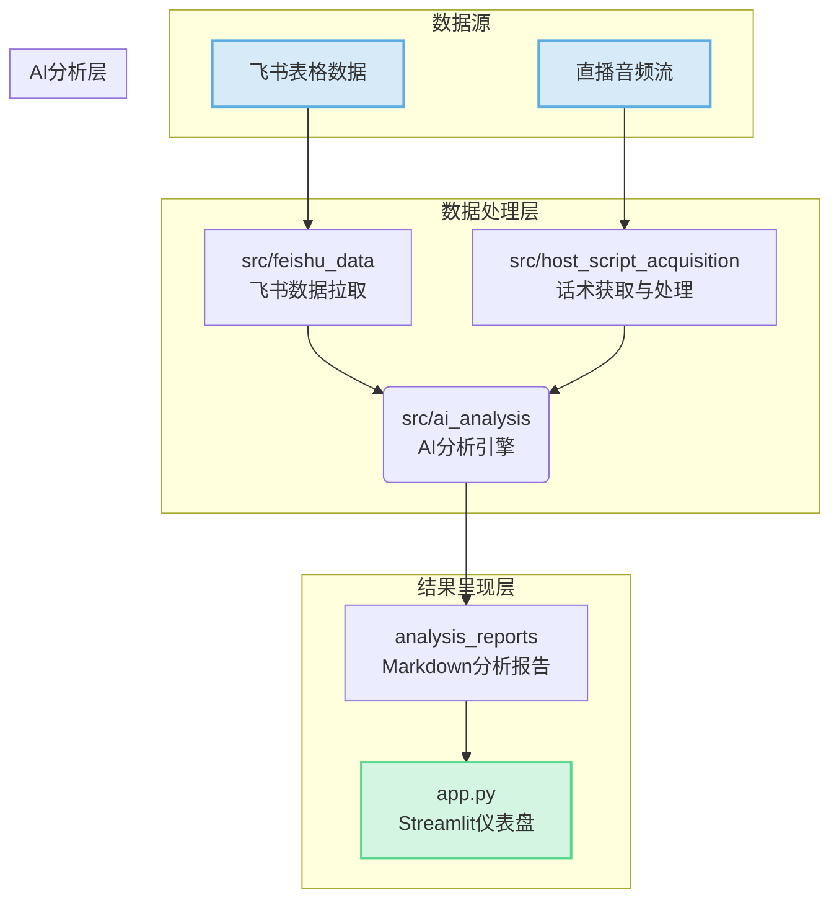

# 直播复盘AI副驾驶系统

本文档是项目的核心说明，请仔细阅读。

## 1. 项目概述

本项目是一个为直播电商设计的AI副驾驶系统，旨在通过数据驱动的方式，实现对直播过程的实时分析、复盘和优化。系统能够自动关联“直播业绩数据”与“主播话术”，发现问题、定位原因，并提供可执行的优化建议，从而提升直播间的转化效率和GMV。

### 核心功能

- **小时级自动复盘**: 自动获取飞书表格中的直播数据，结合主播话术，每小时生成一份包含数据对比、话术分析和优化建议的复盘报告。
- **数据与话术关联分析**: 将销售数据（GMV、转化率等）与对应时间段的主播话术进行绑定分析，精准定位“哪句话带来了转化，哪句话导致了流失”。
- **可视化仪表盘**: 通过Streamlit提供一个交互式的数据仪表盘，直观展示分析报告、核心指标和话术详情。
- **历史趋势可视化**: 通过交互式图表展示业绩指标的历史变化趋势，支持多维度筛选和基线对比。
- **UI美化与响应式设计**: 优化界面布局、色彩搭配和交互体验，确保在不同设备上的良好显示。
- **模块化设计**: 系统采用松耦合的模块化架构，分为数据获取、AI分析、前端展示等模块，易于维护和扩展。

---

## 2. 系统架构



---

## 3. 环境搭建

#### 步骤 1: 克隆项目
```bash
git clone <your-repository-url>
cd conclusion
```

#### 步骤 2: 创建并激活Python虚拟环境
```bash
# Windows
python -m venv .venv
.venv\Scripts\activate

# macOS / Linux
python3 -m venv .venv
source .venv/bin/activate
```

#### 步骤 3: 安装依赖
```bash
pip install -r requirements.txt
```

#### 步骤 4: 配置环境变量
AI分析需要调用豆包AI的API。请在您的系统中设置环境变量 `ARK_API_KEY` 为您的API密钥。

或者，您可以直接修改 `src/host_script_acquisition/config.json` 文件中的 `douban_api.api_key`。

#### 步骤 5: 配置飞书API信息
获取飞书数据需要相应的API访问权限。请确保以下文件中的API配置信息是正确的：

- `src/feishu_data/feishu_sheet_fetcher.py` 中的 `APP_ID`、`APP_SECRET` 和 `SHEET_TOKEN`

如需修改这些配置，请打开文件并更新相应的值。确保您有权限访问目标飞书文档。

---

## 4. 如何运行

本系统由四个主要部分组成，您需要依次或在不同的终端中启动它们。

> **重要提示**：步骤(1)和步骤(3)是系统核心功能的关键部分。飞书数据获取服务需要先启动，然后再启动AI分析引擎，因为AI分析引擎依赖于飞书数据源。请确保飞书数据获取服务正常运行后，再启动AI分析引擎。

#### (1) 启动飞书数据获取服务
此模块负责定期从飞书文档获取直播数据，是系统数据源的关键部分。服务会在每小时的第10分钟自动获取最新的飞书数据，并保存最新的两条记录。
```bash
python src/feishu_data/feishu_sheet_fetcher.py
```
启动后，脚本会立即执行一次数据获取，然后自动以小时为单位持续运行。所有数据将存储在`data/raw/feishu_sheet_data.json`文件中，供AI分析引擎使用。

#### (2) 启动话术获取脚本（可选）
此模块负责将直播中的主播语音实时转为文字。在实际应用中，这应该是一个持续运行的服务。
```bash
cd src/host_script_acquisition
run_sensevoice.bat
```

#### (3) 启动AI分析引擎
此脚本会持续监控飞书数据的更新。一旦数据更新，它会自动获取最新数据和对应话术，进行AI分析并生成报告。
```bash
python src/ai_analysis/ai_analyzer.py
```

#### (4) 启动Web仪表盘
在浏览器中查看分析结果。
```bash
streamlit run app.py
```
启动后，在浏览器中打开 `http://localhost:8502`。

---

## 5. 项目结构

```
.
├── analysis_reports/     # 存放AI生成的Markdown分析报告
├── assets/               # 静态资源文件 (CSS样式等)
├── data/
│   ├── raw/              # 存放从飞书拉取的原始数据 (feishu_sheet_data.json)
│   ├── processed/        # 预留给处理后的数据
│   ├── results/          # 存放分析过程的中间结果 (analysis_results.json)
│   ├── baseline_data/    # 基线数据存储
│   ├── baseline_storage/ # 基线系统状态存储
│   ├── configs/          # 系统配置文件
│   └── storage/          # 历史数据日志存储
├── src/
│   ├── ai_analysis/      # 核心AI分析模块
│   ├── baseline/         # 动态基线引擎模块
│   ├── feishu_data/      # 飞书数据拉取模块
│   └── host_script_acquisition/ # 主播话术获取模块
├── text/                 # 存放从直播语音转换后的话术文本数据库
├── 跑程序必读/
│   ├── README.md         # 本说明文档
│   └── 需求.md           # 原始需求文档
├── app.py                # Streamlit Web应用入口
├── requirements.txt      # Python依赖列表
```
